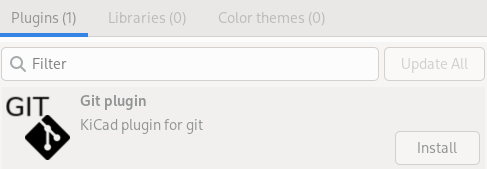
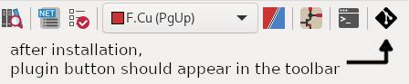
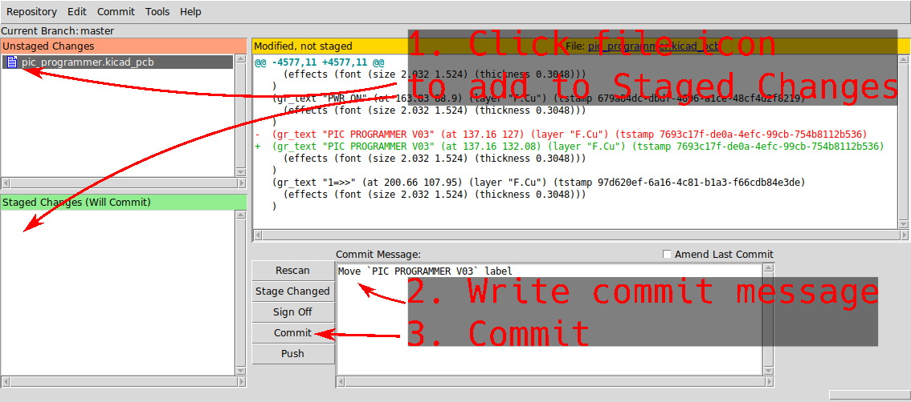

# kicad-git

[](https://gitlab.com/kicad/addons/metadata/-/tree/main/packages/com.github.adamws.kicad-git)

[](https://circleci.com/gh/adamws/kicad-git/tree/master)
[](https://coveralls.io/github/adamws/kicad-git?branch=master)

KiCad plugin for git integration. Launch git commit graphical interface without leaving PCB editor window.

## Installation

To install release version of this plugin, use KiCad's `Plugin and Content Manager`
and select `Git plugin` from official plugin repository.



Latest `master` build is automatically uploaded to unofficial PCM compatible
[repository](https://adamws.github.io/kicad-git/) hosted on GitHub pages.
To use it, add `https://adamws.github.io/kicad-git/repository.json`
to PCM repository list.

> [!WARNING]
> By default, this plugin uses [`git citool`](https://git-scm.com/docs/git-citool).
> On most systems it is distributed as part of the git suite.
> On macOS it might be required to install it separately with `brew install git-gui`

## How to use?

- Click plugin button to open commit window

  

  

### Configuration

To configure different command for starting git GUI or explicitly define git executable path,
create `config.ini` file in the plugin directory.

For example, to use [TortoiseGit](https://tortoisegit.org) and non standard (not in system search `PATH`) git executable:

```ini
[paths]
git = C:\some\path\git.exe
git_gui = TortoiseGitProc.exe /command:commit
```

> [!WARNING]
> The `[paths]` section in config file is required and can't be skipped.

### See also

:link: [PCB visual diff with kicad-cli and lukaj](https://adamws.github.io/pcb-visual-diff-with-kicad-cli-and-lukaj)
